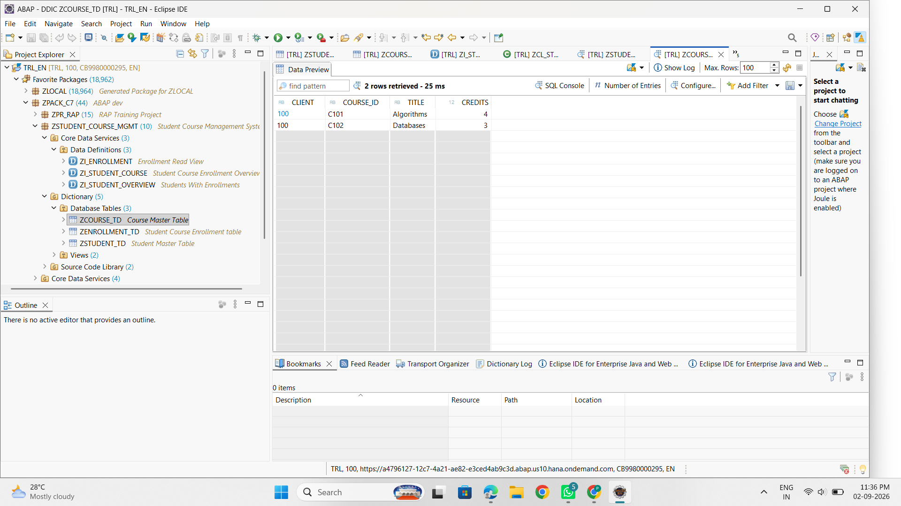
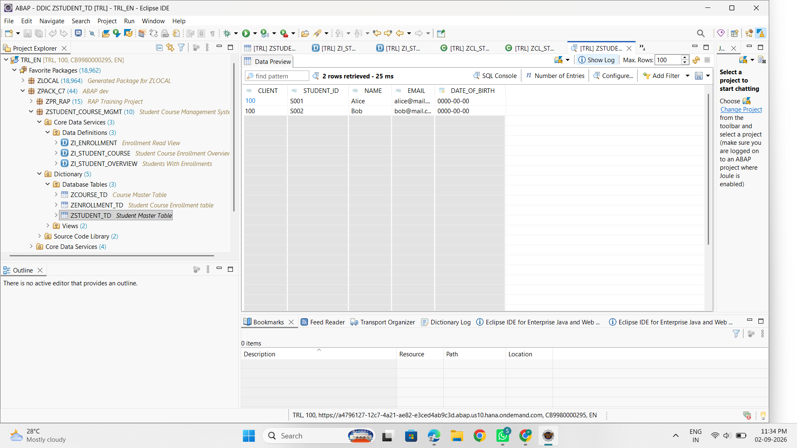
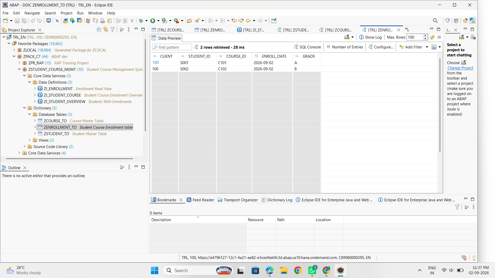
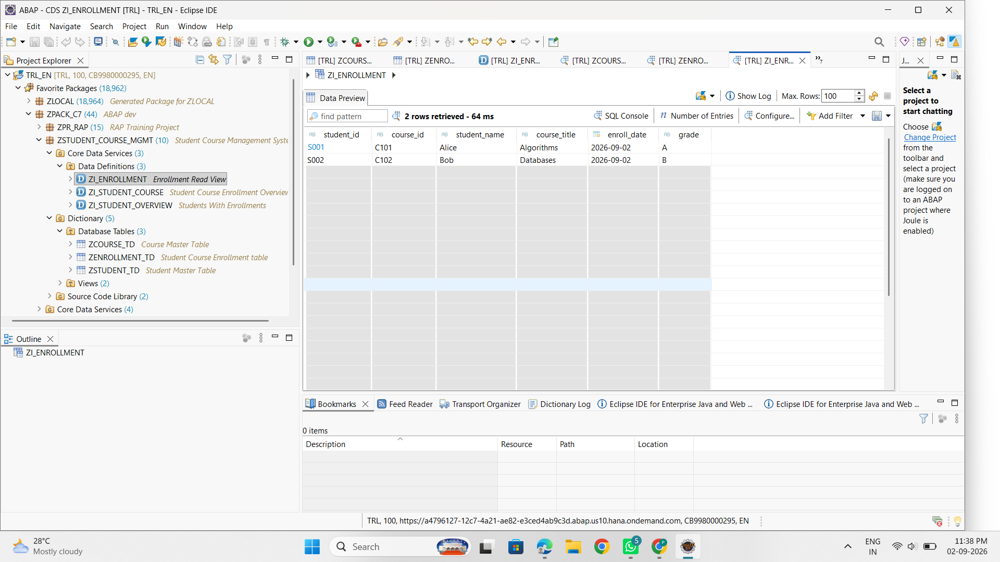
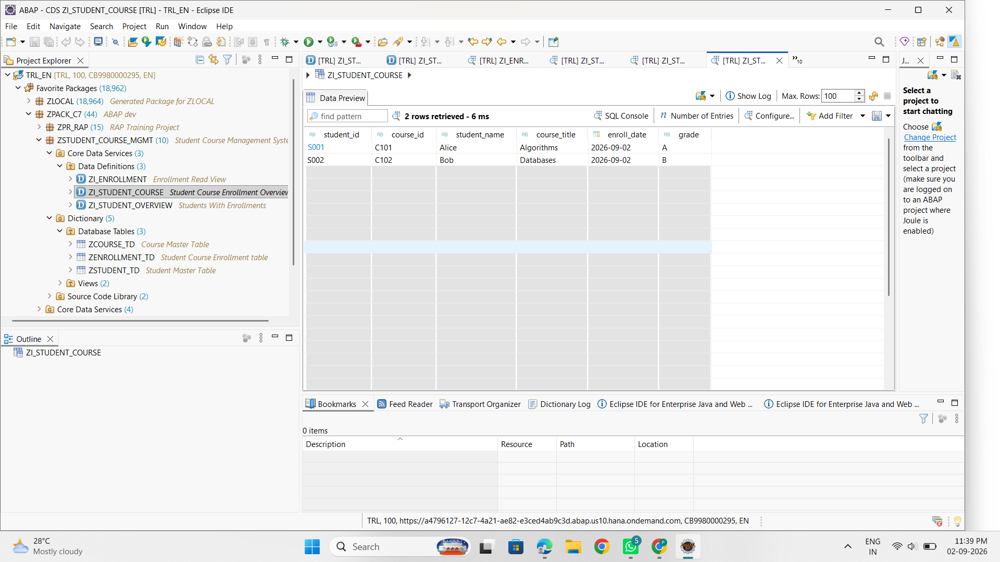
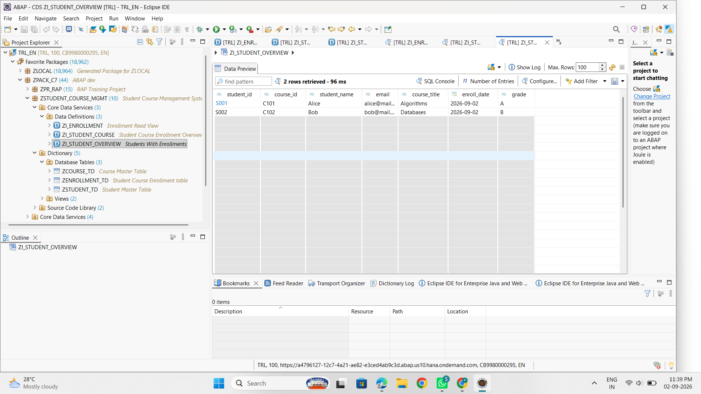

# 🎓 Student Course Enrollment Management System – SAP ABAP Cloud

## 📌 Project Overview

The Student Course Enrollment Management System is a SAP ABAP Cloud
project developed to manage student information, course information,
and student-course enrollments.

The project demonstrates database design, ABAP CDS views, Open SQL,
ABAP Object-Oriented Programming, and console-based reporting using
Eclipse ADT.

## 🛠️ Technologies Used

- SAP ABAP Cloud
- Eclipse ADT
- SAP HANA
- ABAP CDS
- Open SQL
- ABAP Objects
- Git
- GitHub

## 🗄️ Database Tables

The project uses three database tables.

### ZSTUDENT_TD

Stores student master information.

**Fields:**
- CLIENT
- STUDENT_ID
- NAME
- EMAIL
- DATE_OF_BIRTH

### ZCOURSE_TD

Stores course master information.

**Fields:**
- CLIENT
- COURSE_ID
- TITLE
- CREDITS

### ZENROLLMENT_TD

Stores student-course enrollment information.

**Fields:**
- CLIENT
- STUDENT_ID
- COURSE_ID
- ENROLL_DATE
- GRADE

The enrollment table represents the relationship between students
and courses.

## 📊 CDS Views

### ZI_ENROLLMENT

Provides enrollment information by combining student and course
information with enrollment details.

### ZI_STUDENT_COURSE

Provides a student-course enrollment overview.

### ZI_STUDENT_OVERVIEW

Provides an overview of students along with their enrollment details.

## 💻 ABAP Classes

### ZCL_STUDENT_DATA_SEEDER

Used to insert sample student, course, and enrollment data into
the database tables.

### ZCL_STUDENT_COURSE_REPORT

Retrieves student-course enrollment information using CDS and
displays the result through the ABAP console.

## 🔄 Project Execution Flow

```text
Database Tables
       ↓
Sample Data
       ↓
ABAP CDS Views
       ↓
ABAP Classes
       ↓
Student Course Report
       ↓
Console Output

---

## 📸 Project Screenshots

### 1. Course Table

The course table stores course information such as course ID, course title,
and credits.



---

### 2. Student Table

The student table stores student master information including student ID,
name, email, and date of birth.



---

### 3. Enrollment Table

The enrollment table maintains the relationship between students and
courses along with enrollment date and grade.



---

### 4. Enrollment CDS View – ZI_ENROLLMENT

The enrollment CDS view combines student, course, and enrollment data.



---

### 5. Student Course CDS View – ZI_STUDENT_COURSE

This CDS view provides a student-course enrollment overview.



---

### 6. Student Overview CDS View – ZI_STUDENT_OVERVIEW

This CDS view provides an overview of students along with their enrollment
information.



---

### 7. Course Report – ZCL_STUDENT_COURSE_REPORT

The ABAP report class retrieves student-course enrollment information
and displays it through the ABAP console.


